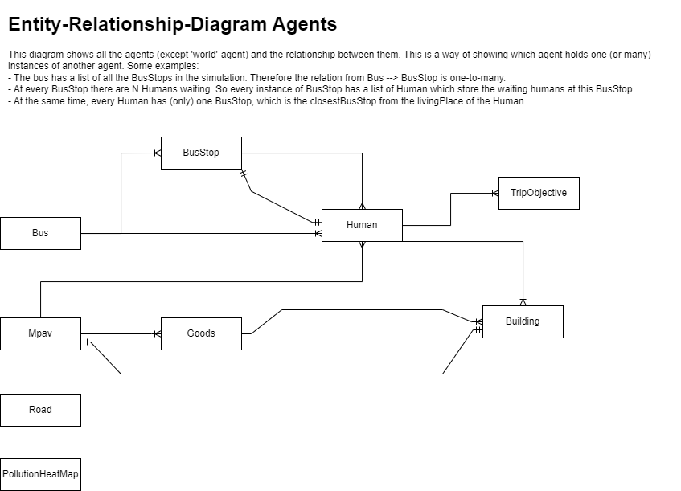

# MPAV Simulation (version: 2.0)
> This repository holds a newer version of the mpav-simulation. The first version can be found in the directory `old_mpav/`.

This GAMA-Project simulates the life of a city. The environment is inspried by the Boston city in the US. In the simulation there are the following agents with following behavior/purpose:
- World: The world agent created by the Gama-Framework.
- Road: Vehicles and Humans can move around on the road graph.
- Building: Humans may enter a building for a certain activity (e.g. work, rest etc...).
- Human: Simulating a single human in the city. See the Human section for details.
- Bus: A vehicle where multiple humans can be transportet (*you don't say scherlock!*).
- BusStop: Specific stop where the bus will drop-off / pick-up humans.
- MPAV: Multi-Purpose vehicle, can transport Goods and Humans to specific buildings directly.
- Goods: Representing things which need to be transportet from A -> B.
- (TripObjective: Only a virtual agent, see Human doc for details).

This is just a simple listing of all the agents in the project, for detailed documentation see the Chapter "Agents".
The Project is split up in multiple files, the next Chapter will describe the purpose of each file.

## Files
- Constatns.gaml: Defines all the constant values of the project and is therefor the single-point-of-truth for constant values. This removed the code-smell of so-called [Magic Strings](https://deviq.com/antipatterns/magic-strings).
- Files.gaml: Defines all the references to the input-files. This allows to have all external file imports in one place. There is a unit-test which may be executed to check if all the file imports work, if the files exist on the disk.
- Functions.gaml: Defines common functions, which may be used in multiple locations in the project ([DRY](https://en.wikipedia.org/wiki/Don%27t_repeat_yourself)).
- Parameters.gaml: Defines all the parameters of the simulation. These values can be modified by the user before starting the simulation.
- Shared.gaml: Defines variables (mostly data-containers like list or map) which are used in multiple locations in the project. This file is also responsible for initializing the values of the shared variables. *Notice: The difference between this file and 'Constatns.gaml' is that the variables are dynamic, meaning they may change during runtime.*
- Agents-Folder: In this directory all the agents files are placed. Find a detailed documentation of the actors in the next Chapter.

## Agents

### Road
The roads of the the city are read via the `Roads.shp`-file. Each road defines which mobilities are allowed, so it could be that a road is only for pedestrians (allows to walk and to ride a bike). There is also the possibilty to read the maxSpeed from the shapefile. Each road can define its own max-speed. 

### Building
Each building has a category (e.g. 'Night' for a bar/nightclub) and a usage (e.g. 'R' for residency). The category influences the color of the building on the map. The Building actor has no reflex, so no behaviour. It is a static agent. 

### Bus
The bus represents a vehicle which transports (only) Humans in the city. There is only one bus for the whole simulation. It moves from one BusStop to the next and starts over when the final stop has been reached. At every stop the bus picks up the waiting people and drops off the people in the bus (which need to leave at this station).

### Mpav
The Mpav is a vehicle which transports Goods and Humans in the city. It can stop at any Building (there are no specific stops like with the bus). Everytime a Mpav reaches a Building it searches the next building (target) to move to. This next target is choosen from a list of all possible targets. The possible targets is a list of buildings where
- a goods needs to be picked up or dropped off
- a human needs to be picked up or dropped off
Out of this list of buildings the closest one to the current location of the Mpav is choosen.

### Goods
Goods can have one of two types: `"food"` or `"packages"`. Goods are spawed every hour of the simulation depending on the `"g_ActivityPerProfile.csv"`. Every good has an `origin` and a `target` building. It is spawned at the `origin` building and needs to be transported to the `target` building.

### Human
A human always has following attributes:
- od: Yves-Note: not quite sure what the purpose of this attribute is. Maybe it defines if the human lives in the city or outside of the city.
- type: Defines the type of the human e.g. `"High School Student"`
- livingPlace: Defines the building it which the human lives
- possibleMobilityModes: All the means of transport the human can use. This list depends on wether the Human has a car or a bike (or both). Every human can walk and take the bus. It can only use the Mpav if the mpav-type allows to transport humans.
- currentPlace: The building the human is in at the current moment.
- closestBuilding: The building which is closest to the current location of the human. Usually this is the building in which the Human is at right now, but sometimes the human wanders around and then this variable stores the information of the closest building. It is mainly used for the transportation type mpav.
- closestBusStop: The BusStop closest to the human.
- publicTransportStatus: If the human decides to use a public transport to reach the target building this variable defines the current state of this transportation. It can have following values (see. Constants.gaml):

    0 = Human is walking to the building where it will be picked up
    
    1 = Human waits at the pick up buildig for the transport vehicle
    
    2 = Human arrives at the closest stop of his target building and walks to his target building

- objectives: All the types of activity a human can have. This list is created at the time of creation and heavily depends on the type of the human.
- currentObjective: Defines the current activity of the Human. This variable is of type TripObjective (see sub-chapter).
- mobilityMode: The choosen mean of transport for the current objective

The humans are spawned at their living place (which is a random building in the city) and start in a 'resting' activity. So in the beginning it does nothing, and just waits (wanders around) until a `currentObjective` is set. Once an objective is assiged to Human moves the the target building of this objective and starts waiting again until a new objective is assigned.

#### TripObjective
A virtual agent, one which is not shown in the simulation, and only used by the human-agents. It defines what kind of activity the human does and where (in which building) this activity takes place. Each activity has a specifig starting hour, see `includes/ActivityPerProfile.csv`.
